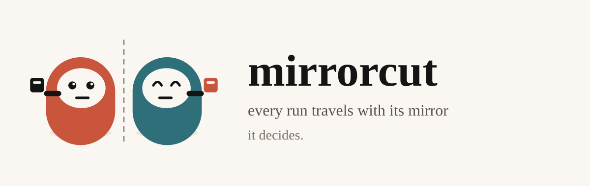
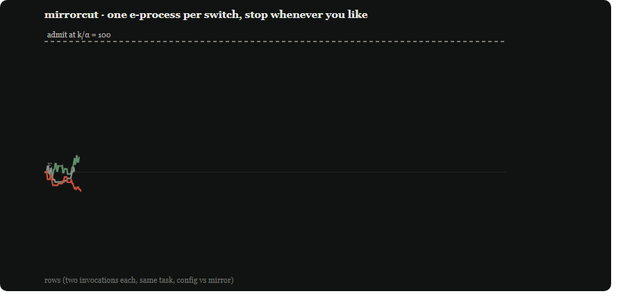
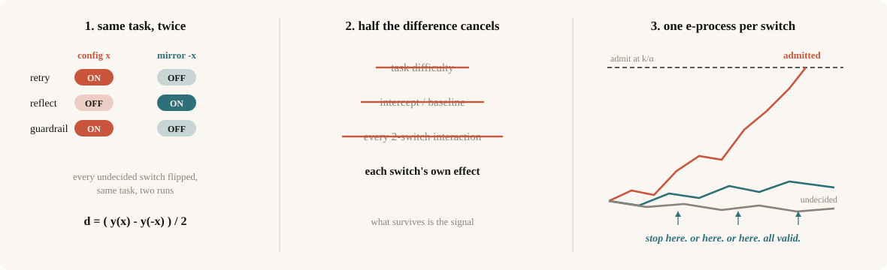

<p align="center"></p>

<p align="center">
<a href="https://github.com/AidenLee0011/mirrorcut/actions/workflows/test.yml"></a>


</p>

```bash
pip install mirrorcut && mirrorcut demo
```

**Your eval is lying to you.** Screen five harness switches the cheap way. If any two of
them interact, you will ship a switch that does nothing - **94 times out of 100**. Then
peek at the results while they arrive, like everyone does when a rollout costs money,
and your 5% false-positive rate is **42%**.

mirrorcut runs every config against its exact mirror and gives every switch its own
e-process. The mirror kills the interactions. The e-process buys you the right to look.
Two runs per row, any number of switches. That's the whole tool.

<p align="center"></p>

<p align="center"><sub>That is the mascot's job description: one twin stamps a switch in, the mirror twin sends one back.
Not a benchmark chart - the same run <code>mirrorcut demo</code> prints, drawn as it happens.</sub></p>

## We killed a guardrail

*Answer only with cited evidence, otherwise refuse.* It sounded responsible. It shipped.
On 358 production tasks mirrorcut called it **harmful at row 199** - evidence 115.9
against a threshold of 100. We checked it cold: the same 120 fresh tasks run under both
configurations. **64/120 passing with the guardrail, 80/120 without** - 24 discordant
pairs, 20 of them against the guardrail; paired 95% CI [-21.0, -5.7] points of pass
rate, exact McNemar p = 0.0015. The guardrail is gone. Nobody had to argue about it in
a meeting.

The full setup, stack and ledger: [`CASE-STUDY.md`](CASE-STUDY.md).

## Use

```python
from mirrorcut import MirrorScreen

screen = MirrorScreen(["retry", "reflect", "strict_guardrail"], max_rows=600)

for i, task in enumerate(tasks):
    cfg, mirror = screen.next_pair(task_id=i)   # a configuration and its exact mirror
    screen.observe(run(task, cfg),              # same task, both times
                   run(task, mirror))
    if screen.done:                             # every switch decided, or budget spent
        break                                   # summary()["stopped"] says which
```

`run(task, cfg)` is yours: it takes a dict of switch names to booleans and returns your
verifier's score in [0, 1]. `mirrorcut demo` runs exactly this on a simulator calibrated
to a production agent, and prints:

```
retry              admitted   at row 574   effect on pass rate +9.6pp
reflect            undecided    effect on pass rate +2.7pp
strict_guardrail   pruned     at row 483   effect on pass rate -12.2pp
rows 600   invocations 1200   (at $0.01/run: $12)
```

One switch admitted, one pruned, one honestly undecided. `undecided` is a real outcome,
and what it costs is below. Parallel workers: draw with `next_batch(n)` (batches may
overlap - rolling workers never stop), observe out-of-order with
`observe_batch(row_id, y, y_mirror)`; bets freeze at draw time, so the guarantee is
unchanged. Every verdict carries `effect_pp_ci95`, an anytime-valid interval you may
read at any moment without spending error.

| | point comparison | full factorial | **mirrorcut** |
|---|---|---|---|
| an interaction can frame an inert switch | yes | no | **no, by construction** |
| look anytime, stop anytime | looks are free but wrong | no - fixed n | **yes, error intact** |
| cost as switches grow | 2 runs x candidates | 2^k configs | **2 runs per row, any k** |

Measured error rates for every arm, with replication counts: [`RESULTS.md`](RESULTS.md).

## What it costs

`mirrorcut plan` simulates your setting before you spend on it. Three cells at $0.01 per
invocation (medians over 40 simulated screens, calibrated world):

| switches | effect worth detecting | rows to first decision | rows to all live switches | at $0.01/run | at $0.10/run |
|---|---|---|---|---|---|
| 5 (2 live) | 15pp | 801 | 2,720 | $54 | $544 |
| 5 (1 live) | 10pp | 3,138 | 3,138 | $63 | $628 |
| 10 (2 live) | 10pp | 2,502 | 4,353 | $87 | $871 |

At agent prices this is a real budget line - which is why `plan` exists and why
`undecided` is a reported outcome instead of a hidden one. Small effects are genuinely
expensive to detect; no procedure changes that. What mirrorcut changes is that you may stop the moment the evidence is in, and an
undecided switch is reported as undecided instead of shipped by accident.

## The mechanism, in sixty seconds

<p align="center"></p>

Write the outcome as a polynomial in the switch levels. Run at `x` and at `-x` on the
same task and take half the difference: every even-order term cancels - the intercept,
the task difficulty, and **all two-factor interactions**. What survives is each switch's
own effect. Because levels are drawn independently, each per-switch signal has mean zero
under its null, so each switch carries a betting e-process, and Ville's inequality makes
every verdict valid at any stopping time. Ancestry (antithetic variates, SPSA, mirrored
sampling) and what is actually new here: [`LIMITS.md`](LIMITS.md).

## Paired or unpaired, decided before you spend

The mirror costs two invocations per row and pays only when tasks differ in difficulty.
Both arms ship, and the chooser is the paper's criterion computed on your own pilot:

```python
from mirrorcut import pairing_gain, shrunk_rates, UnpairedScreen

report = pairing_gain(shrunk_rates(pilot_outcomes), effect=0.1)
Screen = MirrorScreen if report["recommend"] == "mirror" else UnpairedScreen
```

Feed `shrunk_rates`, not raw per-task means: few draws per task inflate the apparent
spread with binomial noise and bias the choice toward the mirror.

## What it is not

It is not a runtime, an optimiser, or a framework. It decides. Your agent runtime keeps
executing, your context policy keeps compressing, your prompt-edit loop keeps proposing.
mirrorcut replaces exactly one thing: the acceptance rule. At a measured 11.7% replay
flip rate, adopt-if-better false-adopts nearly every round (`mirrorcut doctor` prints
the arithmetic for your numbers, or use the no-install page in `docs/doctor.html`).
The point of the arithmetic: adopt-if-better has no null hypothesis, so noise does not
change its false-adoption rate - an inert candidate wins by symmetry - it only changes
how much regression you eat after adopting. The screen judges the same candidates at
the same budget with the family-wise rate held. Loop wiring, tool-subset and agent-graph recipes:
[`ADOPTION.md`](ADOPTION.md).

## CLI

```
mirrorcut demo        # the run quoted above, byte-identical (a test asserts it)
mirrorcut doctor --candidates 8 --rows 320
mirrorcut plan --k 5 --effect 0.10 --cost 0.10
mirrorcut run --switches retry,reflect,guard --exec ./run_task.sh     --ledger s.jsonl --max-rows 2000 --timeout 600 --seed 7 --deadline 6
mirrorcut report s.jsonl [--json] [--junit out.xml] [--svg paths.svg] [--html replay.html]
mirrorcut report s.jsonl --html-live viewer/   # live dashboard: follows the ledger as it grows
```

`--html` writes a self-contained node-flow replay of the whole run - the task splitting
into config and mirror lanes with every switch's ON/OFF visible, outcomes, and each
switch's evidence meter climbing to its verdict. The production run's replay is live at
the project page; yours is one flag.

`run` hands each drawn config to `--exec` as JSON on stdin and reads a [0,1] score from
its stdout. Failure policy, stated: non-zero exit, unparsable stdout or timeout means
the row is abandoned and logged, and the run aborts if abandons outpace observations -
config-correlated failures shift the estimand (LIMITS.md #7). The ledger resumes across
nights, refuses a changed screen, and `report` rebuilds the exact screen from the
ledger's own header.

`report`'s exit code is CI-meaningful: 0 nothing pruned, 1 something pruned, 2 bad input.

## Verified, and how to check

`tests/` (23 checks, seconds) covers the guarantee at the library level: null runs stay
at the nominal rate, live effects are recovered, an interaction cannot frame an inert
switch, ledgers refuse to resume a changed screen, batched runs replay to identical
verdicts in any arrival order, and a crashed worker cannot brick a screen. `tests/test_calibration.py 400`
reproduces the calibrated numbers. The full study - factorial and fold-over baselines,
interim-look failures, the paired-versus-unpaired sweep, the live run and its
confirmation - is the paper in [`paper/`](paper/), and its per-arm tables are in
[`RESULTS.md`](RESULTS.md).

## Honest limits

- The estimand averages over the other switches; `pin=` re-screens against the deployed config.
- After the first admission the guarantee is the intersection null over committed contexts.
- `effect` is the half-difference; `effect_pp` is the outcome-scale number humans want.
- The mirror can produce configs you would never ship: pin what must not move.
- A retired (futility) switch is held off - a shipping decision without an error statement.
- Admissions and prunings are separate families at alpha each; one combined number reads 2 alpha (`summary()` reports all three).
- Heavy task reuse voids fresh-randomness assumptions; the screen warns at runtime.
- Crashes: `abandon()` unbricks the run, but config-correlated crashes shift the estimand.
- The estimator is old; the per-switch e-process on top is the new part.

Full versions, with the propositions they lean on: [`LIMITS.md`](LIMITS.md).

## FAQ

**Why not just A/B each switch?** Adopt-if-better is a coin flip per inert candidate at
realistic noise (`mirrorcut doctor`: q = 0.484 at 320 rows per side; at least one false
adoption per round with probability 0.995 at 8 candidates). Exact arithmetic, not a
simulation.

**Doesn't randomising configs already fix aliasing?** Yes - and the paper says so
plainly. The mirror is a variance device: it cancels the task effect row by row.
`pairing_gain` tells you whether that is worth the second invocation on your tasks.

**Does it work with graded (non-binary) scores?** Yes, anything in [0, 1]; graded
verifiers are where the mirror pays most (paper, Table 8).

## Citing

```bibtex
@article{mirrorcut2026,
  title  = {MirrorCut: Anytime-Valid Screening of Agent Harness Components},
  author = {Lee, S.},
  year   = {2026},
  note   = {Manuscript in the repository's paper/ directory; arXiv id pending}
}
```

## Licence

Apache-2.0. See `LICENSE`.
